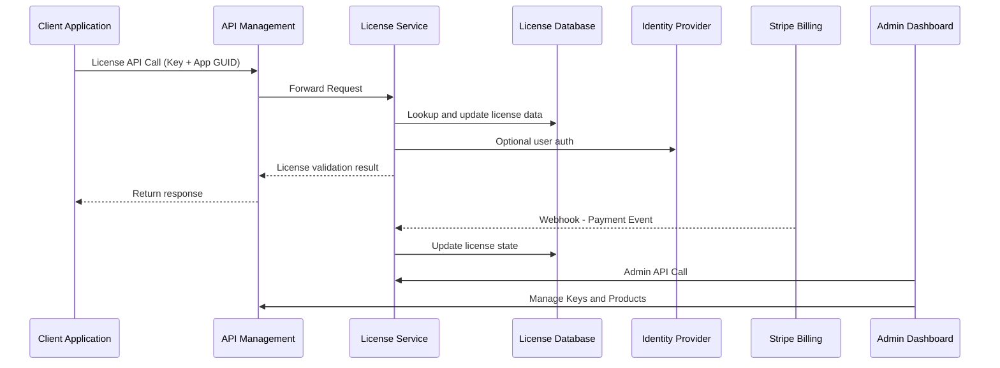
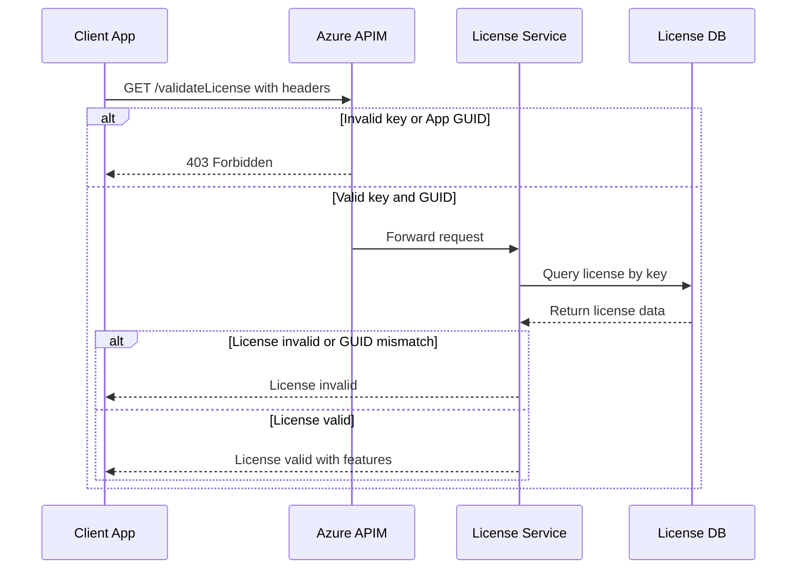
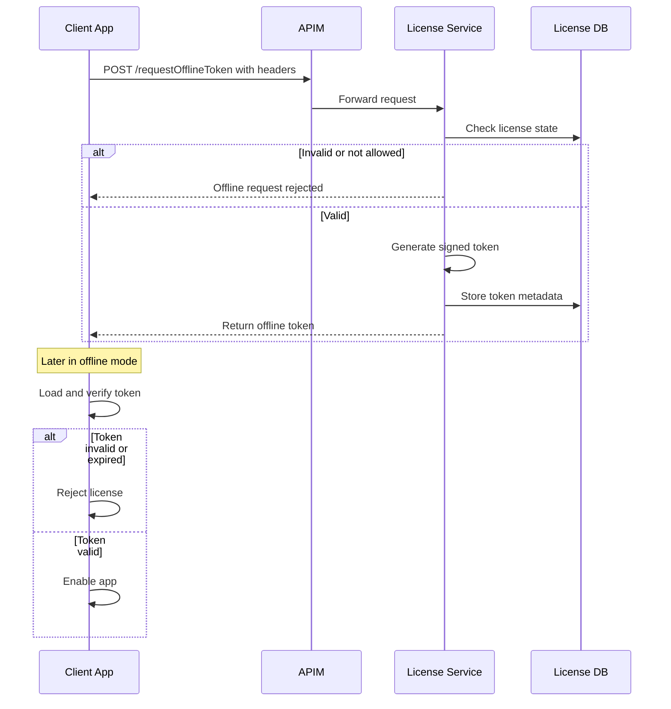
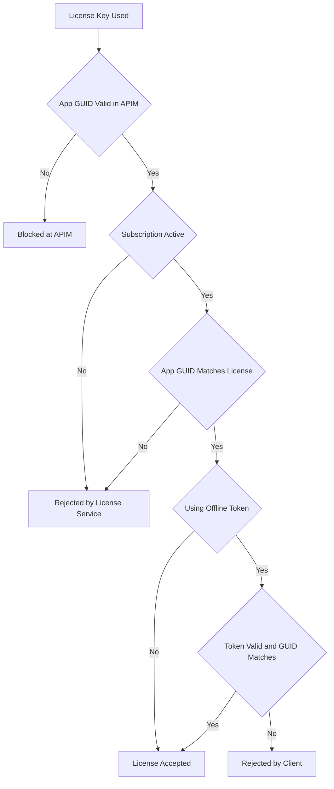

# Software Licensing Framework on Azure – Architecture Overview

## Introduction

This document describes a **software licensing framework** hosted on **Microsoft Azure**, designed for a single software vendor to manage license keys, subscriptions, and feature entitlements for their products. The architecture integrates **subscription billing** (using Stripe), **Azure API Management (APIM)** for API gateway and key management, and a custom **License Service** for business logic. It supports **cryptographically secure** license key generation, **online license validation** (with a configurable offline grace period for temporary offline use), and handles subscription lifecycle events (trials, pauses, cancellations, lapsed payments). The framework is intended for software architects and senior developers and emphasizes security, scalability, and clarity.

## Key Requirements

* **Subscription Billing (Stripe)**: Use Stripe for subscription billing. The design allows adding other payment gateways in future.
* **Secure License Keys**: Generate license keys using cryptographically secure methods. Validate licenses both online (by calling the license service) and offline (within a grace period) to prevent tampering or guessing.
* **Online/Offline Validation**: Require online validation with an **offline grace period** (configurable). Users can run the software offline for a limited time without contacting the server.
* **Subscription Lifecycle**: Support **free trials**, the ability to **pause/unpause** subscriptions, handle **cancellations** and **lapsed payments** with grace periods before disabling licenses.
* **Single-Vendor Model**: The system is single-tenant (one vendor’s product portfolio). Multi-tenancy (multiple independent vendors) is not in scope, simplifying the design.
* **Independent Identity System**: End-users (customers) should **not** be required to exist in the vendor’s corporate Azure AD. Use a separate, secure identity store for customer accounts (e.g. **Azure AD B2C**, Auth0, etc.), isolating customer identities from the vendor’s internal directory.
* **API Management for Licensing**: Use **Azure API Management (APIM)** to manage the licensing API endpoints, products, and subscriptions. License keys are managed as APIM subscription keys, and APIM policies enforce certain license constraints (like requiring an App GUID header).
* **Flexible License Scope**: Licenses can be issued for:

  * Entire **desktop applications** (Windows, Mac, Linux executables)
  * **Desktop plugins** or modules within larger software
  * Specific **features** within an app (feature-level licensing)
  * **Cloud-hosted services or features** (SaaS components)
* **Admin Dashboard**: An internal admin web portal for the vendor to manage users, license plans, billing status, and grace period settings.

## High-Level Architecture

The solution comprises several Azure-based components orchestrated to handle license issuance, validation, and billing. The diagram below illustrates the main components and interactions in the system:

**Component Descriptions**:

* **Client Application**: The end-user’s software (desktop app, plugin, etc.) that needs license validation. It contains an **Application GUID** (unique identifier for the app or plugin) and integrates with the licensing system via API calls or offline tokens.
* **Azure API Management (APIM)**: Serves as a secure API gateway in front of the License Service. APIM manages **Products** and **Subscriptions** to represent licensing plans and license keys. Each license key corresponds to an APIM subscription key issued to a customer upon purchase. APIM policies enforce required headers and basic validation (e.g., ensuring a request includes a valid key and correct App GUID header).
* **License Service**: A custom backend (could be an Azure Function app or Web API) that implements core licensing logic. It handles license key generation/validation, subscription state checks, issuing offline tokens, and applying business rules (trial expiry, grace periods, feature entitlements, etc.). The License Service communicates with the database, the identity provider, APIM (if needed), and processes Stripe webhook events.
* **Identity Provider**: A separate customer identity directory (e.g., Azure AD B2C) for managing end-user accounts and authentication. This allows customers to sign up/login with email or social accounts securely, without being tied to the vendor’s internal Azure AD. The License Service may use this for authenticating users on the admin portal or associating licenses to user accounts, but license validation for software clients typically relies on keys rather than interactive login (to allow offline use).
* **License Database**: Stores persistent data about customers, licenses, and subscriptions. For example, it may store user profiles (with Identity Provider IDs), license entitlements (which product/app a license is for, its status, expiration or trial info, offline token issuance timestamp, etc.), and mapping of APIM subscription IDs or keys to specific applications/features (App GUID). This could be an Azure SQL Database, Cosmos DB, or other reliable store.
* **Stripe Billing System**: Handles payment processing and subscription billing. The system uses Stripe for creating customer subscriptions (plans corresponding to license plans). Integration is done via **Stripe Webhooks** – Stripe sends events (e.g., payment succeeded, payment failed, subscription canceled) to a designated endpoint (an Azure Function or the License Service), which then updates the license status accordingly in the database and via APIM APIs. For example, if a payment fails and a grace period lapses, the License Service can mark the license as inactive (and optionally disable the APIM subscription key). Conversely, on successful payment or resumption, it reactivates the license.
* **Admin Dashboard**: A secure web application for the vendor’s internal use. It allows administrators to manage products (plans), view users and their subscriptions, adjust settings (like offline grace period, trial lengths), and manually override or update licenses if needed. The admin portal communicates with the License Service (through protected admin endpoints) and possibly directly with APIM’s management API for certain operations (e.g., creating a new product in APIM or revoking a subscription key). The admin portal would likely use the vendor’s internal Azure AD for authentication (since it’s internal), or a role-protected section of the system.

## Azure API Management Configuration

**APIM Products as Plans**: In this design, each licensing **plan** or **product** offered by the vendor is represented as a *Product* in Azure API Management. For example, there might be products like “**MyApp Pro Plan**”, “**MyApp Trial**”, “**MyApp FeatureX Add-on**”, “**Plugin Y License**”, etc. Each Product in APIM can be configured with which API endpoints it includes (likely all share the same License API, but segregating by product allows APIM to issue distinct keys and enforce policies per product).

**APIM Subscriptions as License Keys**: When a user purchases or activates a plan (e.g., via Stripe checkout), the system (through automation or the Developer Portal) creates a new **APIM subscription** under the corresponding Product. This generates a unique subscription key – that key serves as the **license key** given to the end-user. The user/software uses this key for license validation calls. After a successful Stripe payment and subscription creation, the user is provided the key (e.g., shown on a portal or emailed). Each subscription key is unique, random, and cryptographically hard to guess (APIM keys are GUID-based or high-entropy strings by default, fulfilling secure generation requirements). The key is essentially an API key used to call the License API.

**Enforcing License Scope in APIM**: To prevent misuse of a license key across different applications or features, APIM implements a policy requiring an **App GUID** header:

* Each request from a client must include an HTTP header like `X-App-Id` with the unique identifier of the application/feature making the request.
* APIM’s inbound policies (which can be set at the Product or API level) use a check to ensure the header exists and matches the expected value for the product. For example, the “MyApp Pro Plan” product can have a policy that checks `X-App-Id == <GUID of MyApp>` and rejects the call if not. Azure APIM’s `check-header` policy allows enforcing a header’s presence and specific value, aborting the request with an error if the check fails. This means if a license key for MyApp is accidentally (or maliciously) used by another product, the header check will fail.
* Additionally, APIM always validates that the `Ocp-Apim-Subscription-Key` (the subscription key provided) is valid and belongs to the product/api being called. Only if the key is valid and not revoked will APIM forward the call to the backend. This two-layer check (valid key + correct App ID) is the first line of defense.

**Rate Limiting & Quota (Optional)**: APIM can also enforce rate limits or quotas if needed (for instance, if a certain license type should only allow a certain number of activations or API calls per period). This is optional for the licensing scenario, but APIM’s policies provide flexibility if, say, trial licenses should only validate a limited number of times, etc.

**APIM and Identity**: APIM’s Developer Portal could optionally be used to allow users to sign up, view their subscription (license) keys, and manage their profile. However, since we want an independent identity system, we would integrate APIM’s developer portal with Azure AD B2C (APIM can delegate developer authentication to an external IdP). This way, customers log into the portal using B2C, and APIM maps them to APIM user accounts. Each APIM subscription (license key) is then associated with an APIM user (customer). This integration is possible via OAuth/OpenID Connect in APIM’s portal settings. Alternatively, a custom web portal can handle user sign-up and then call APIM’s REST API to create subscriptions.

## License Key Generation and Security

**Cryptographic Key Generation**: License keys generated via APIM (subscription keys) are by nature cryptographically strong random strings (128-bit+ entropy). If a custom generation method is needed (for example, if not using APIM’s keys for some reason), the system would use a secure random generator or GUID v4 for keys. We avoid patterns that could make keys guessable. All secret keys and certificates (e.g., Stripe secrets, JWT signing keys) are stored securely in **Azure Key Vault**.

**Asymmetric Signature for Offline Tokens**: The system uses **asymmetric cryptography** to avoid embedding secrets in client software. For instance, any offline license token or signed license file is generated by the server with a **private key**, and the client contains a corresponding **public key** to verify it. This approach ensures that the validation logic in the client does not require any secret that could be extracted by hackers. By using strong algorithms (RSA or ECDSA for signatures, or AES for encryption of token payloads if needed), the license tokens cannot be forged or altered without access to the server’s private keys.

**Data in License Tokens**: When issuing offline license tokens (discussed below), the License Service embeds relevant data (claims) inside the token – such as the license’s expiration date, the allowed App GUID, perhaps the user or device ID if tying to a machine, and any feature flags. This embedded data allows the client to verify entitlements offline. Such self-contained tokens follow the principle used by advanced licensing systems: *“offline-capable licenses may have a useful dataset embedded in the key itself, including license expiration, grace periods, customer info, and entitlement data”*. The token is signed (and optionally encrypted) to prevent tampering.

**Secure Storage and Transmission**: License keys and tokens are considered secrets. The keys are transmitted to the client over HTTPS (either viewed on a secure portal or via an email to the user). The client stores the key and any offline token securely (e.g., in encrypted application storage) to prevent easy extraction. On the server side, the license database may store hashes of keys or the keys in a secure format (APIM stores subscription keys internally and can be accessed via management API if needed). All API calls for validation use HTTPS, and we employ standard protections (throttling, logging, monitoring via APIM, etc.) to detect abuse.

## Subscription and Billing Integration (Stripe)

Stripe is used to handle customer payments and subscription lifecycle. The integration works as follows:

* **Plan Setup**: For each product or plan (e.g., Pro, Trial, Feature add-on), a corresponding **Stripe Plan/Product** is created in Stripe with pricing. The SKU in Stripe can be linked or named in a way to correlate with the APIM Product/plan. For example, a Stripe plan “MyApp Pro Monthly” corresponds to APIM product “MyApp Pro”.

* **User Purchase Flow**: When a user decides to purchase a license (or start a trial), they are directed through a workflow: they authenticate via the identity system, then choose a plan. The system then either uses **Stripe Checkout** or Stripe’s API to create a subscription. This can be done from a custom portal or through APIM’s developer portal (APIM has a monetization preview that integrates Stripe, enabling a flow where after selecting a product, the user is sent to Stripe for payment). In either case, the Stripe checkout collects payment details securely. On successful payment, Stripe creates a **Subscription object** and a **Customer record**.

* **License Provisioning**: Once payment succeeds, we need to provision the license in our system. There are two possible approaches:

  1. **Synchronous provisioning**: The application/portal calls our backend after Stripe checkout returns success, to create the APIM subscription (license key). For example, using Stripe’s client API and webhooks to know when payment is complete, then calling APIM’s REST API to create a subscription under the appropriate product for the user. The user is then presented with their license key immediately.
  2. **Webhook-driven provisioning**: Configure a Stripe **webhook endpoint** (e.g., an Azure Function or an endpoint in License Service) to listen for the `checkout.session.completed` or `invoice.payment_succeeded` events. When received, the License Service verifies the event (using Stripe’s signing secret) and then creates the APIM subscription key and stores the info. This approach is robust in case the user flow doesn’t return (network issues, etc.), ensuring license creation even if the front-end flow is interrupted.

* **Linking Stripe and APIM**: It’s crucial to map a Stripe subscription to the corresponding license in our system. The License Service might store the Stripe subscription ID in the database alongside the APIM subscription ID (license key). This allows cross-referencing: e.g., if a payment fails for Stripe subscription XYZ, we know it corresponds to license ABC in our system.

* **Handling Renewal, Failure, Cancellation**: Stripe will send webhook events for various subscription lifecycle events:

  * *Renewal Payment Succeeded*: Typically no action needed other than maybe extending next billing date, but license remains active.
  * *Payment Failed*: This triggers a grace period for payment. We configure in Stripe how many retry attempts and days to keep the subscription before canceling. During this period, the License Service can mark the license as **past-due**. We might still allow the user to use the software in a limited grace period. After grace or final failure, Stripe sends a subscription canceled or unpaid status event.
  * *Subscription Canceled or Unpaid*: When Stripe ultimately cancels a subscription (user-initiated or due to non-payment), the webhook triggers the License Service to **revoke or suspend** the license. The License Service can call the APIM Management API to either disable that subscription (APIM subscriptions can be **cancelled** or deleted). If deleted, the key becomes immediately invalid; if not, we could set its state to “expired” by setting an expiration date or marking user as not entitled in DB. For safety, we prefer to disable at APIM level so that any calls with that key are rejected. Alternatively, APIM keys could remain but the License Service would then fail validation – but that still allows calls to hit our service. Disabling at APIM stops usage at the gate.
  * *Subscription Paused/Resumed*: Stripe now supports pausing subscriptions. A pause event can be communicated via a webhook (as a status change). On pause, the License Service could similarly suspend the license key (maybe mark it inactive in DB or temporarily revoke APIM access). On resume, re-enable it. Since APIM doesn’t natively have a “pause” state, implementation could be to **swap the key** to a placeholder or set a policy that rejects requests while paused. A simpler approach is to treat “pause” like non-payment: mark license as suspended so validation calls fail (even if APIM accepts the key, the License Service would respond with a status indicating license not active).

* **Free Trials**: Trials can be implemented either as a Stripe free trial period on a paid plan or as a zero-cost plan. If using Stripe’s trial period (e.g., 14 days free then auto charge), the license key is provisioned at sign-up and flagged as trial in our DB with an expiry. The License Service knows the trial end from either Stripe or from our own settings. When trial expires (Stripe will start billing or cancel if no payment method), we get an event. If user doesn’t convert, license can be deactivated. Alternatively, a separate “Trial” product and license could be issued that auto-expires after X days (APIM subscription can have an expiration date set, or the License Service simply enforces via last validation date).

* **Grace Periods**: Two types of grace periods exist:

  * **Offline Grace**: (for license validation when user is offline, see next section) – configured per license or globally.
  * **Payment Grace**: Time between a payment failure and actual suspension. We handle this in Stripe settings (e.g., retry 3 times over a week). The License Service might allow some extra days of functioning (perhaps via offline token issuance to not constantly call server during this time). This is a business decision: some vendors allow a few days of continued use after a failed payment as courtesy. Our system can accommodate this by not immediately revoking the APIM key until grace is over, or by the License Service returning a warning status but still “valid” during grace.

## License Validation Flows

License validation can happen in two ways: **Online** (the app contacts the License Service via APIM to check the license in real-time) and **Offline** (the app uses a locally issued token during an approved offline period). The following sections detail both flows with **Mermaid sequence diagrams** and describe how **App GUID enforcement** and **misuse prevention** are applied in each case.

### Online License Validation with App GUID Enforcement

In the typical scenario, whenever the client application runs (or at regular intervals), it performs an online check to verify the license key’s validity. This ensures the user’s subscription is active (not canceled or expired) and that the license key is being used with the correct application. The sequence diagram below illustrates this process:

**Explanation**:

1. **Client Request**: The client app includes the license key (as `Ocp-Apim-Subscription-Key`) and its Application GUID (`X-App-Id`) in an HTTPS request to the license validation API. The request might be a simple endpoint like `/validateLicense` (which could return a JSON indicating “valid/invalid” and associated info like remaining trial days or enabled features). The client might call this on startup and then periodically (e.g., daily or weekly) while online.

2. **APIM Enforcement**: Upon receiving the call, **Azure API Management** first checks that the subscription key is valid – meaning it matches an active subscription in APIM. If the key is invalid, APIM immediately rejects with an unauthorized error. Next, APIM’s policy checks for the presence of `X-App-Id` header and validates its value. Using the configured product-level policy, APIM compares the header value to the expected GUID for the product (or it could call out to the License Service or a cache to verify the mapping). If the header is missing or does not match the expected application ID, APIM will **terminate the request**, returning a 403/401 error to the client without even hitting the backend. This is a first-pass **GUID enforcement** to stop obvious misuse (e.g., someone trying to use a valid key for another app).

3. **Forward to License Service**: If APIM’s checks pass, the request is forwarded to the License Service. APIM can pass context information – for instance, it could inject the APIM **Product ID or name** into a header so the License Service knows which plan the key is for, or simply rely on the key to look up the license. Because APIM already validated the key, the License Service can trust that it’s a known key, but it will perform its own checks for business rules.

4. **License Service Validation**: The License Service uses the license key to find the corresponding license record in the database. This record would include details such as: associated user/account, the App GUID or product it’s tied to, license status (active/paused/canceled), expiration date if any, last payment status, trial info, and any feature entitlements. The service then evaluates:

   * **App GUID Match**: It compares the App GUID from the record with the `X-App-Id` provided (this duplicates APIM’s check, but adds defense-in-depth – if for some reason APIM policy was misconfigured or someone bypassed APIM, the service itself would detect a GUID mismatch and reject the request). This double-check ensures the license key is indeed meant for that application.
   * **Subscription State**: It checks if the license is active. If the Stripe subscription tied to this license is canceled or payment is severely overdue beyond grace, the license might be marked as inactive in the DB. In such case, the service will respond that the license is not valid (even though APIM let the call through). Similarly, if an admin manually paused the license, that status is checked.
   * **Trial or Expiry**: If the license is a trial, the service checks the trial period. If the current date is beyond trial expiry, it will mark it invalid or require conversion. If the license has an expiration date (some licenses might be time-limited), it checks that as well.
   * **Payment Grace**: If a payment failed but we are within an allowed grace period (e.g., 7 days since failure), the service might still consider the license valid (maybe with a warning flag). This logic can be coded as needed. After grace, the status would be inactive.
   * **Feature Checks**: If the call is asking about a specific feature (the request could include a feature ID the client wants to use), the service verifies the license includes that feature. Alternatively, the client might always request validation for the whole app, and the response includes which features are enabled in the current plan.

5. **Response**: Based on these checks, the License Service returns a response. For a valid license, it could return a JSON payload like: `{"status":"valid", "plan":"Pro", "features":["FeatureX","FeatureY"], "expires":null}` or similar. If invalid, it would return an error code/message (which the client app will interpret to possibly deactivate itself or prompt the user). The APIM gateway then relays this response back to the client.

6. **Post-Validation Update**: The License Service might update some fields – e.g., record the timestamp of this validation. This is useful for offline scenarios: the last online validation time can be used to determine how long the app has been offline. Also, it provides an audit trail of usage. APIM also logs the call (which could be used for monitoring license usage frequency, etc.).

**App GUID Enforcement Recap**: In the above flow, the App GUID is enforced at **two levels** (APIM and License Service). This prevents a user from using a license key intended for one application in another. For example, if a user had a license for “App A” (with App GUID A) and tried to use it on “App B” (GUID B):

* If they use App B (which would send GUID B), APIM sees the key belongs to Product “App A Pro” expecting GUID A, so APIM immediately rejects it.
* If an attacker tried to bypass this by modifying the call to fake `X-App-Id: A` while using App B, APIM would then let it through (thinking it’s App A). However, the **License Service** on checking may notice that the user identity or other context doesn’t line up (this scenario is more of an edge case – normally the client app won’t allow sending a different App ID easily). In a simple implementation, the License Service would actually be tricked if only App GUID is checked. To mitigate high-level tampering, one could incorporate an **application-specific secret** or signed token from the app to prove the app’s identity. This goes into anti-piracy/DRM measures – beyond our current scope – but it’s noted as a potential enhancement. In most cases, the dual App GUID check is sufficient to stop non-technical misuse (sharing keys across products).

### Offline License Token Issuance and Validation Flow

Many users may need to use the software in an offline environment (no internet access) for some period. To accommodate this while still enforcing license validity, the system provides **offline license tokens**. An offline token is essentially a time-limited license file or code (for example, a signed JWT or certificate) that the client can store and use to self-validate when offline. The process involves issuing such a token when the user is online, and the client using it until it expires. Below is the sequence of how offline mode is handled:

**Explanation**:

1. **Requesting an Offline Token**: When the user anticipates being offline (for example, a field worker taking a laptop with no internet), the client can proactively request an offline token. This could be triggered automatically (the app detects no internet and uses a cached token) or via a user action (like clicking “Go Offline” which calls the API). The request goes to an endpoint such as `/requestOfflineToken` (via APIM, using the normal license key and App GUID for auth). Optionally, the client might indicate how long it needs offline access (the server may impose a max regardless).

2. **Validation Before Issuing**: The APIM and License Service perform the same checks as in online validation (ensuring the key is valid, app GUID matches, subscription is active, etc.). The License Service may have additional rules: e.g., perhaps offline tokens cannot be issued for certain plans (maybe a cheap plan requires always-online, whereas a premium plan allows offline). Or if the license is near expiration (say subscription ends tomorrow), it might limit token duration or refuse (to avoid giving offline access beyond the license term). If any check fails (license not valid, or user exceeded offline usage quotas), the service returns an error.

3. **Token Generation**: If all is good, the License Service generates an **offline license token**:

   * It collects necessary data: the **license ID or number**, the **App GUID** (binding the token to the specific application), the **issue time** (current timestamp) and **expiry time** for offline use. The expiry is typically “now + offline\_grace\_period”. For example, if the policy is to allow up to 14 days offline, it might set expiry 14 days from now (or a shorter period to force occasional check-ins).
   * It may also embed the **entitled features** or plan level in the token so that the app knows what it can use offline. If the token just contains an identifier and expiry, the app could infer features from the plan if it’s coded in, but embedding feature flags allows dynamic enabling/disabling without a new binary.
   * The token is then **digitally signed** by the License Service. Using a private key (stored in Key Vault), it creates a JWT (JSON Web Token) or a custom license file format. The signature ensures authenticity – the client will later verify this with a public key. The token could also be encrypted if it contains sensitive data, but since it’s for the client’s use, signing is typically enough.
   * The License Service records that an offline token was issued, and when it expires. This could be stored to audit usage or to potentially refuse issuing another token if, say, the device hasn’t come online after a long period. (Some systems issue one token at a time per license to avoid abuse.)

4. **Token Delivery**: The token (often a long string or a small file) is returned to the client through APIM. The client app receives it and stores it (e.g., in the file system or secure storage). The token’s expiry timestamp might also be conveyed separately or encoded inside.

5. **Offline Validation by Client**: Now the client has everything needed to self-validate:

   * On each launch, if the app cannot reach the License Service (no internet), it will load the saved token.
   * The app verifies the token’s **signature** using the public key embedded in the app (the public key corresponds to the private key the server used, completing the asymmetric scheme). If the signature check fails, the token has been tampered with or is from an untrusted source – the app should treat the license as invalid.
   * The app then checks the **expiry time** in the token. If the current date is beyond the expiry, the offline period has ended – the app should require re-validation online (possibly warning the user “License offline token expired, please reconnect”).
   * The app also checks the **App GUID** in the token against its own hardcoded App GUID. If these don’t match, it means the token was meant for a different application or product. In that case, the app must reject it. (This prevents someone from taking a token from App A and trying to use it in App B – App B will see the GUID mismatch and fail the validation.)
   * (Optional) The app can enforce any feature restrictions by reading claims in the token. For example, if the token says the user only has “FeatureA”, the app will only enable that feature offline.

   If all checks pass, the app considers the license valid and runs normally (perhaps with a note in the UI that it’s offline and will expire on X date). If any check fails, the app should disable licensed features or stop running (maybe grace the user a day or limited functionality, but that’s a policy decision).

6. **Returning Online**: Once the user is back online (or the token is nearing expiry), the app should contact the License Service again to renew the token or just perform a normal online validation. The server can then issue a new token if appropriate. This ensures that an offline token cannot be used indefinitely – the user must reconnect periodically. The period (offline grace) is configurable; common values are 7, 14, or 30 days, depending on the business model (longer offline support is more user-friendly but riskier if someone tries to abuse it).

**Security Considerations for Offline Mode**: The offline token is effectively a bearer token that confers license rights without contacting the server. Thus:

* It is locked to a specific app (via GUID) and can even be locked to a specific device or user if we include, say, a hardware ID or user ID in it. The current requirement only specified App GUID, but the system could be extended to also include a **device fingerprint** in the token for stronger binding (preventing copying the token to another machine). However, device binding can inconvenience users (especially if hardware changes), so it’s configurable.
* The token’s lifetime is limited to reduce risk. Even if leaked, it expires relatively soon.
* Because it’s signed, it cannot be altered (e.g., changing the expiry or GUID would break the signature).
* The public key in the app should be hard to extract (not plain text in binary). In .NET or other, one can use obfuscation or embed it in native code, etc. But even if extracted, it only allows verifying tokens, not forging them.

### Preventing License Misuse via App GUID and Other Checks

Preventing misuse of license keys (such as sharing keys between users or across unauthorized apps) is a critical aspect of this framework. The **App GUID enforcement** is one major mechanism, ensuring each license key or token is tied to one software product. Here we summarize how the system guards against key misuse at multiple levels:

**Explanation**: The flowchart above illustrates layered defenses:

* **APIM Policy Layer**: Immediately stops any request where the `X-App-Id` header doesn’t match the expected value for the given license key’s product. This prevents accidental mixing of licenses and apps. For example, if someone somehow got hold of a license key for Product A and tried to use it in Product B’s app (which would send Product B’s App ID), APIM won’t even forward the call. The misuse is blocked at the gateway.
* **License Service – Subscription Status**: Even if the correct App GUID is provided, the License Service checks that the license is in good standing (not canceled or expired). A user trying to use a canceled license (perhaps by avoiding an update) will be rejected here. This also covers misuse like continuing to use a trial license after it’s expired or a subscription after non-payment beyond grace – the service knows it’s invalid and will not approve.
* **License Service – App GUID Double Check**: The service double-checks the App GUID against its record for that license. If somehow the request got through APIM with a wrong GUID (e.g., APIM policy misconfig or a scenario where one license might cover multiple apps – not in our model, but just in case), this would catch it. It also ensures that the license data itself (in DB) has the correct association.
* **Client Offline Check**: In offline mode, the client itself becomes the enforcer. If a user tries to reuse an offline token for another app or after it’s expired, the client’s built-in checks will fail and the app won’t run. The offline token contains the App GUID and expiration, so a token issued for App A can’t be used on App B’s software – App B will see the GUID doesn’t match and will reject it. This is critical because when offline, neither APIM nor the License Service can intervene – the client must self-police based on the token’s integrity.

Additionally, to address general license misuse (like sharing a key with friends or posting it online):

* **Rate Limiting / Device Limits**: The architecture can be extended to track how many devices are using the same key. For instance, the License Service could record a “device fingerprint” on first use and enforce a maximum number of unique devices (like 1 or 2 concurrent devices per license). APIM or the service could limit the number of active sessions or validations per day to detect abuse. These features were not explicitly required, but the design is flexible to incorporate such policies if needed in the future.
* **User Identity Binding** (optional): If each license is tied to a user account (in the identity system), the client app could require the user to log in (especially for cloud features). This way a license key alone isn’t enough – it must be used by the rightful account. In our framework, we chose not to force login for desktop apps to allow offline use, but cloud-hosted features could enforce authentication via Azure AD B2C tokens in addition to license key, adding another layer. APIM can accept a JWT from B2C in Authorization header along with the subscription key (this would ensure the call is coming from an authenticated user). This is an enhancement for scenarios where user identity matters in addition to possession of key.

## Handling Trials, Cancellations, and Pausing

The system fully manages the **lifecycle of a subscription license** through integration of Stripe events and internal logic:

* **Trial Licenses**: A trial can be implemented as a special product or a Stripe trial period. The License Service knows when a trial expires (either via a Stripe event or an internal timer). Upon expiration, it can either automatically convert the user to a paid subscription (if payment info was collected) or disable the license key. For a graceful user experience, the client app can be informed of trial days remaining on each validation (the License Service can include `trialDaysRemaining` in the response). This way, the app can show the user “Trial ends in X days” proactively. When 0 days remain, the service marks the license as needing upgrade – validation will start failing (or return a special code like “trial\_expired”) and the app can prompt the user to purchase.
* **Subscription Pausing**: If a user pauses their subscription (through the billing system or by request), the License Service on receiving that event will mark the license as paused. In APIM, we might not have a direct “paused” state, so the service could either temporarily disable the key or simply have its validation logic return an error “subscription paused” to the app. The app should then restrict access (possibly inform the user the subscription is paused). When a resume event comes (via Stripe or admin action), the license is reactivated and validations succeed again.
* **Cancellation**: A user-initiated cancellation typically means they’ve canceled future billing. Often, subscriptions run until the period end. We can let the license remain valid until the end of the paid period. Stripe would send an event like “subscription canceled” but also provides an end date. The License Service can keep the license active until that date, then auto-expire. If the user tries to use after that, it will fail. If instead immediate cancellation is desired (for refunds perhaps), the system can revoke immediately. In APIM, this could mean deleting the subscription or marking it expired.
* **Lapsed Payment**: As discussed, when payment fails, Stripe’s dunning process will attempt retries. During this time, the license could be in a “past due” status. We may choose to keep it active for a short grace (to avoid cutting off the user instantly for one failed charge). However, the License Service could warn the client (some license validations might include a flag “payment\_due”\:true). If eventually payment is not recovered and Stripe cancels the subscription, the license becomes invalid. The next time the client checks online, it will get an invalid response. If the client was offline, once the offline token expires, they won’t be able to renew it (since the license is off). We might want the offline token not to extend beyond a known billing cycle in such cases – e.g., if payment failed, perhaps don’t allow issuing a fresh 30-day offline token, to ensure the app comes back online to verify.

All these transitions are handled by either **Stripe webhooks** or an admin manually via the dashboard:

* Stripe webhook calls the License Service with the event data. The service finds which license it corresponds to (using stored Stripe subscription IDs) and updates the DB and possibly calls APIM (to revoke keys if needed).
* The admin portal can also be used for customer support: for instance, an admin could manually extend a trial, grant a complimentary month, reinstate a canceled sub, or issue a refund and cancel. The admin portal would have functionality to perform these actions by updating the database and calling Stripe/APIM as needed. For example, to revoke a license immediately, an admin click could delete the APIM subscription, making the key unusable at once.

## Admin Dashboard and Monitoring

The **Admin Dashboard** is an internal tool for the vendor’s team. Key features of the admin dashboard include:

* **User Management**: View/search customer accounts (from the B2C identity or mirrored in the license DB), see what licenses and subscriptions they have, and their status.
* **License Management**: View all issued license keys (APIM subscriptions) and their details (product, creation date, last validation, etc.). Admins can manually create a new license (e.g., for a customer who paid offline), revoke or regenerate keys (APIM allows key regeneration if a key is compromised), or transfer a license to a different user if needed.
* **Plan Management**: Define and update the license plans (these might correspond to APIM products and Stripe products). For example, create a new “Pro Lifetime” plan, or adjust the features associated with a plan. Some of this might involve updating APIM products or just changing logic in the License Service (if, say, we add a new feature flag).
* **Billing Overview**: Through Stripe’s API or dashboard links – quickly see a customer’s Stripe status, or initiate a refund, etc. The admin portal could integrate Stripe’s API to show payment history.
* **Offline Usage Monitoring**: The system can log offline token issuances and perhaps require devices to check-in. Admins might see which licenses have been offline for how long, to detect if someone is exploiting offline mode beyond intended use.
* **Analytics**: Using APIM’s analytics or custom logs, the vendor can see how often license validations are happening, active user counts, etc. APIM provides metrics per key, which could feed into usage-based licensing if needed in future (not in current scope but possible).
* **Security & Audit**: Admin actions should be audited. Only authorized staff (authenticated via corporate Azure AD or a special role in AD B2C) can access the admin functions. Changes to license states should be logged (who did what). This ensures accountability.

The admin dashboard likely communicates with the License Service through a separate set of APIs (which could still be exposed via APIM but protected by role-based access, or bypass APIM and use an internal endpoint). For example, an admin API might allow listing all subscriptions or forcing a status change. These should require admin authentication (APIM can validate JWT tokens issued to admins, or the app service can be internal only).

## Conclusion

This Azure-based licensing framework provides a **comprehensive solution** for software license management, combining cloud services with secure design principles:

* It uses **Stripe** for robust billing and integrates those events into license state changes.
* **Azure API Management** is leveraged to securely expose license functionality, manage keys, and enforce per-application license constraints at the gateway level.
* A custom **License Service** contains the business logic for licenses, ensuring flexibility in handling trials, grace periods, and various license scopes (apps, plugins, features).
* **Security** is woven throughout: from cryptographically strong key generation and **asymmetric cryptography for offline tokens**, to multi-layer checks preventing key misuse across applications.
* The inclusion of an **offline mode** with controlled tokens balances user flexibility with protection of the software’s revenue.
* Finally, the system remains **extensible**: new products or features can be added by creating new App GUIDs and plans, other identity providers or payment processors can plug in (thanks to modular design), and multi-tenancy could be introduced in the future by partitioning the data and APIM configuration per vendor if ever needed.

By adhering to these architectural elements and processes, the software vendor can reliably control access to their software products, provide a smooth user experience (automatic online validation and graceful offline support), and minimize unauthorized usage of licenses, all while offloading heavy lifting to Azure’s managed services where appropriate. The result is a secure, scalable, and maintainable licensing platform tailored for modern software distribution.
