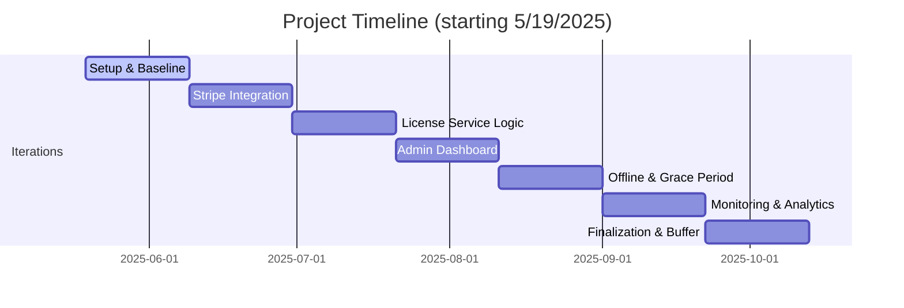

# Project Planning

This document outlines the expected scope of work, rough order of magnitude (ROM), and a proposed development timeline for the Subscription Framework.

## Project Scope

The framework delivers a licensing platform for a single software vendor. It uses **Stripe** for subscription billing, **Azure API Management** for API gateway and key management, and a custom **License Service** for handling subscription state, license validation, and offline tokens. An internal admin dashboard allows administrators to manage plans and licenses.

## Rough Order of Magnitude

A senior engineer working approximately **20 hours per week** can deliver a minimal production system in about **4–6 months**. The effort breaks down roughly as follows:

1. **Environment & Core Service (3–4 weeks)** – provision Azure resources and scaffold the License Service.
2. **Stripe & Subscription Handling (3–4 weeks)** – integrate Stripe webhooks and automate license creation.
3. **License Validation & Security (3–4 weeks)** – implement online/offline validation and secure key handling.
4. **Admin Dashboard (3–4 weeks)** – build the internal portal for managing users and plans.
5. **Refinements & Testing (3–4 weeks)** – add monitoring, analytics, and prepare for deployment.

## Development Iterations

1. **Setup & Baseline**
   - Provision Azure resources.
   - Scaffold the License Service and initial APIM configuration.
2. **Stripe Integration**
   - Configure Stripe products and webhook handling.
   - Automate APIM subscription creation after payment.
3. **License Service Logic**
   - Persist license records and enforce App GUID checks.
   - Provide offline token generation.
4. **Admin Dashboard**
   - Secure portal for managing plans and license states.
5. **Offline & Grace Period Handling**
   - Finalize offline validation and handle paused/canceled subscriptions.
6. **Monitoring & Analytics**
   - Instrument services and document deployment.

## Proposed Timeline

The exact dates may shift as the project progresses, but this provides an estimated sequence of work assuming a 20-hour work week.
